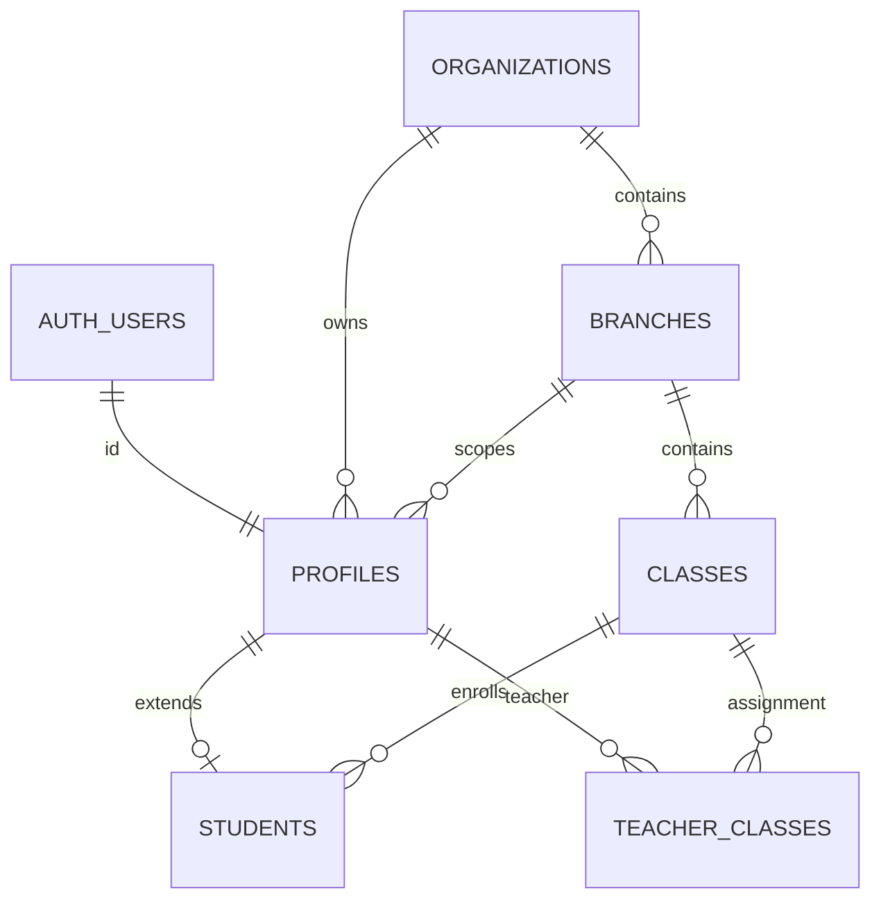

# Stage 2 Data Model Review

Status: `APPROVED FOR IMPLEMENTATION WITHIN STAGE 2`

## Authority and scope

This review applies the frozen G0 baseline, especially `LOGICAL_DATA_MODEL.md`,
`ROLE_AND_SCOPE_MODEL.md`, `STUDENT_AUTH_POLICY.md`, and
`DOCUMENT_AUTHORITY_MAP.md`. Stage 2 is limited to the tenant and identity
foundation: organizations, branches, classes, profiles, students, and
teacher/class membership.

The existing files in `supabase/migrations/20260825*.sql` are retained as
historical prototype material. They are not canonical Stage 2 migrations and
must not be applied by the Stage 2 verification procedure.

## Canonical hierarchy and identity

```text
auth.users (authentication identity)
  -> profiles (application identity, exactly one organization)
       -> students (mandatory 1:1 extension for role=student)

organizations
  -> branches
       -> classes
            -> students
            -> teacher_classes <- teacher profiles
```



- `profiles.id` is the same UUID as `auth.users.id`.
- A profile has exactly one `organization_id`.
- Organization administrators have `branch_id IS NULL`.
- Every other MVP role is branch-scoped and has a non-null branch.
- Every student has explicit organization, branch, and class membership.
- `students.profile_id` is mandatory and unique.
- Teachers are profiles; no parallel teacher or application-user identity is
  introduced.

## Table mapping

### `organizations`

- Purpose: tenant root and organization operational-day timezone.
- Authority: `LOGICAL_DATA_MODEL.md` sections 2 and 7; OD-001 and OD-007.
- Primary key: UUID `id`.
- Tenant key: the row's own `id`; no branch key.
- Foreign keys: none.
- Uniqueness: globally normalized `code`.
- Lifecycle: `active`, `suspended`, or `archived`; physical client deletion denied.
- Direct client access: scoped reads; organization-admin update only. Creation is
  reserved for a later trusted provisioning path.
- RLS boundary: active profiles in the same organization; mutation only by its
  `organization_admin`.

### `branches`

- Purpose: branch beneath one organization.
- Authority: hierarchy in `LOGICAL_DATA_MODEL.md` and
  `ROLE_AND_SCOPE_MODEL.md`.
- Primary key: UUID `id`.
- Tenant key: mandatory `organization_id`; branch key: `id`.
- Foreign keys: organization to `organizations` with restricted deletion.
- Uniqueness: normalized `code` per organization; composite
  `(organization_id, id)` supports tenant-safe FKs.
- Lifecycle: `active`, `suspended`, or `archived`; physical client deletion denied.
- Direct client access: scoped read; organization-admin insert/update and
  branch manager/admin update inside their branch.
- RLS boundary: organization admin sees own organization branches; every
  branch-scoped actor is restricted to their own branch.

### `classes`

- Purpose: class/group beneath one branch.
- Authority: frozen hierarchy and mandatory student class assignment in
  `LOGICAL_DATA_MODEL.md`.
- Primary key: UUID `id`.
- Tenant key: mandatory `organization_id`; branch key: mandatory `branch_id`.
- Foreign keys: composite `(organization_id, branch_id)` to `branches`.
- Uniqueness: normalized `(branch_id, code, academic_year)`; composite
  `(organization_id, branch_id, id)` supports tenant-safe FKs.
- Lifecycle: `active`, `suspended`, or `archived`; physical client deletion denied.
- Direct client access: scoped reads; organization/branch managers may
  insert/update inside their scope.
- RLS boundary: organization, branch, assigned-teacher class, or own-student
  class as defined by actor role.

### `profiles`

- Purpose: sole application identity for every authenticated person.
- Authority: OD-003, `LOGICAL_DATA_MODEL.md` section 3, and
  `STUDENT_AUTH_POLICY.md`.
- Primary key: UUID `id`, also FK to `auth.users(id)`.
- Tenant key: mandatory `organization_id`; branch key is null only for
  `organization_admin` and mandatory for every other role.
- Foreign keys: organization and composite organization/branch.
- Uniqueness: one profile per auth identity; composite organization/identity
  keys support tenant-safe references.
- Lifecycle: `invited`, `active`, `suspended`, or `archived`.
- Direct client access: scoped SELECT only in G2. Client INSERT/UPDATE/DELETE is
  denied; trusted provisioning belongs to Stage 3/4.
- RLS boundary: self, organization admin, scoped branch managers/admins, and
  linked student profiles for an assigned teacher.

### `students`

- Purpose: mandatory 1:1 student extension carrying class membership and a
  minimal organization-scoped student code.
- Authority: OD-003, `LOGICAL_DATA_MODEL.md` section 4, privacy baseline, and
  `STUDENT_AUTH_POLICY.md`.
- Primary key: UUID `id`.
- Tenant key: mandatory `organization_id`; branch key: mandatory `branch_id`.
- Foreign keys: mandatory unique `profile_id` via composite profile FK and
  mandatory `class_id` via composite class FK.
- Uniqueness: `profile_id`; normalized student code per organization.
- Lifecycle: `active`, `suspended`, or `archived`; physical client deletion denied.
- Direct client access: scoped reads; organization/branch managers may
  insert/update only within scope after trusted identity provisioning.
- RLS boundary: own student row, organization admin, scoped branch
  manager/admin, or teacher explicitly assigned to the student's class.

### `teacher_classes`

- Purpose: many-to-many authorization relationship because a teacher may teach
  more than one class.
- Authority: `LOGICAL_DATA_MODEL.md` section 4 and
  `ROLE_AND_SCOPE_MODEL.md` teacher scope.
- Primary key: `(teacher_id, class_id)`.
- Tenant key: mandatory `organization_id`; branch key: mandatory `branch_id`.
- Foreign keys: composite teacher-profile FK and composite class FK; a trigger
  requires the referenced profile role to be `teacher`.
- Uniqueness: primary key prevents duplicate assignment.
- Lifecycle: relationship row; authorized managers add/remove it. No archive
  column is necessary because the relationship has no history semantics at G2.
- Direct client access: assigned teacher may read; organization/branch managers
  may read, insert, and delete within scope; update is denied.
- RLS boundary: own active teacher assignment or manager within the same tenant
  and branch.

## Frozen modeling decisions applied

- UUID primary keys use `gen_random_uuid()`.
- Codes are compared as `lower(btrim(code))`; the submitted display value is
  retained.
- Lifecycle values are text columns protected by named check constraints.
- Operational relationships carry explicit `organization_id`; branch-scoped
  relationships also carry explicit `branch_id`.
- Composite foreign keys make cross-organization or cross-branch references
  impossible even for privileged writers.
- Students contain only the minimum Stage 2 fields: identity link, tenant and
  class membership, student code, lifecycle state, and timestamps.
- Deletion is not part of the normal lifecycle. RLS exposes no delete policy for
  tenant entities; records are suspended or archived.

## Deliberately excluded

Authentication flows, PIN handling, provisioning workflows, UI, Dhikr/Wird,
offline storage, synchronization, rewards, dashboards, reports, and
production-data transition are outside Stage 2.

## Consistency result

No active contradiction was found among the authoritative G0 documents. Any
legacy prototype shape that differs from this model remains historical and
does not override the frozen baseline.
